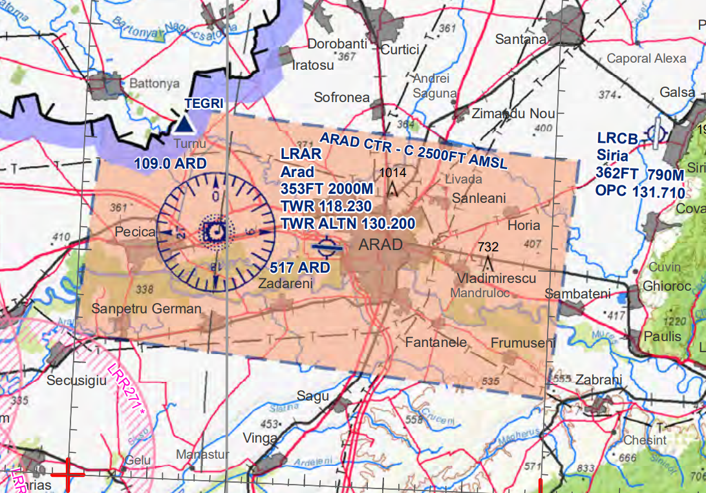

LRAR - Arad International
=========================

General
"""""""

Arad Airport, while being an international one, is not an airport regularly operated by any of the commercial airlines. However, the airport is an important point in air navigation service as it is a provider for control in TMA Arad and soon for the first Virtual Tower in the country.

Frequencies
"""""""""""

+-----------------+-----------------+-----------+
| Login Call sign | Call sign       | Frequency |
+-----------------+-----------------+-----------+
| LRAR_TWR        | Arad Tower      | 130.200   |
+-----------------+-----------------+-----------+
| LRAR_APP        | Arad Approach   | 127.250   |
+-----------------+-----------------+-----------+
| LRBB_L_CTR      | Bucharest Radar | 122.025   |
+-----------------+-----------------+-----------+

Area of Responsability
""""""""""""""""""""""

TWR is responsible for air traffic service on runway 09/27 and Arad Control Zone, taxiways and aprons. TWR issues clearances, both IFR and VFR.

APP is responsible for air traffic service in TMA ARAD, classified as Class C Airspace, where both IFR and VFR are allowed to fly.

Area charts
"""""""""""

Runway operations
"""""""""""""""""

The airport has one runway: 09/27.

Due to noise abatement procedures and apron position, preferred runway for departure is 27 and for arrival is 09, applied only in low traffic conditions. Any change of the departure and/or arrival direction shall be coordinated with APP unit.

+-----------------+--------------+--------------+
| Runways         | 09           | 27           |
+-----------------+--------------+--------------+
| Runway heading  | 91           | 271          |
+-----------------+--------------+--------------+
| Length          | 6562ft/2000m                |
+-----------------+--------------+--------------+
| ILSAPP          | NO           | CAT2         |
+-----------------+--------------+--------------+
| VORAPP          | YES          | YES          |
+-----------------+--------------+--------------+
| NDBAPP          | NO           | NO           |
+-----------------+--------------+--------------+
| Prefered config | ARR          | DEP          |
+-----------------+--------------+--------------+
| Deicing         | on parking position         |
+-----------------+--------------+--------------+

Clearance
"""""""""

Both RNAV and conventional SIDs are available, but RNAV are highly recommended. Non standard departure shall be coordinated with APP unit.

Taxi
""""

Departing and arrived traffic shall be instructed to follow standard taxi routes available on AIP LR AD 2.1-14.

Stand assignments
"""""""""""""""""

It is generally at the discretion of the ATC.

+-------+--------+-------------------+
| Apron | Stands | Procedure         |
+-------+--------+-------------------+
| 1     | 3-5    | self maneuvering  |
+-------+--------+-------------------+
| 2     | 1-2    | self maneuvering  |
+-------+--------+-------------------+

LVP
"""

During LVP, aircrafts shall be instructed to follow standard taxi routes with Follow Me guidance.

Traffic regulation
""""""""""""""""""

CTR Arad is classified as Class C Airspace where both IFR and VFR are allowed to enter.

CTR Cluj lower limit is the ground level and the upper limit is 2500 ft AMSL (by QNH).

VFR traffic circuits are allowed at 1500 ft AMSL (by QNH). VFR traffic could be cleared to climb in TMA only by APP unit. A coordination between TWR and APP units shall be in force.
