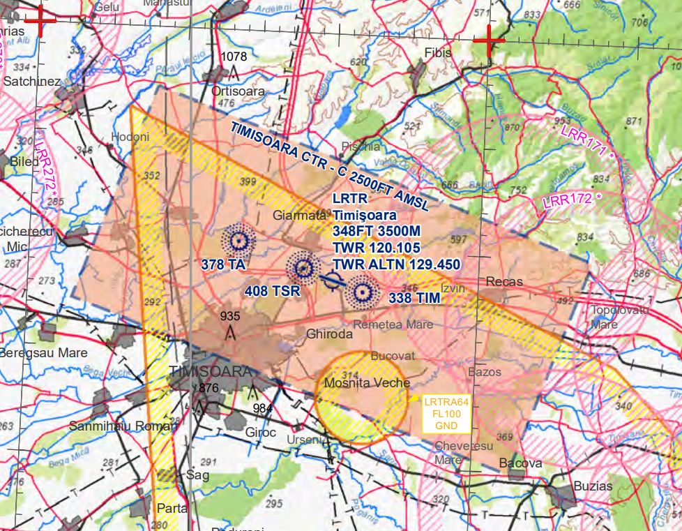

LRTR - Timișoara Traian Vuia International
==========================================

General
"""""""

Timisoara Airport is the main airport in Western Romania, an important cargo hub for the area. 

Frequencies
"""""""""""

+-----------------+------------------+-----------+
| Login Call sign | Call sign        | Frequency |
+-----------------+------------------+-----------+
| LRTR_GND        | Timisoara Ground | 121.600   |
+-----------------+------------------+-----------+
| LRTR_TWR        | Timisoara Tower  | 120.100   |
+-----------------+------------------+-----------+
| LRAR_APP        | Arad Approach    | 127.250   |
+-----------------+------------------+-----------+
| LRBB_L_CTR      | Bucharest Radar  | 122.025   |
+-----------------+------------------+-----------+

Area of Responsability
""""""""""""""""""""""

TWR is responsible for air traffic service on runway 11/29 and Timisoara Control Zone, taxiways and aprons. TWR issues clearances, both IFR and VFR.

APP is responsible for air traffic service in TMA Arad, classified as Class C Airspace, where both IFR and VFR are allowed to fly.

Area charts
"""""""""""

ATIS
""""

TWR is responsible for updating and maintaining Timisoara ATIS.

Runway operations
"""""""""""""""""

The airport has one runway: 11/29.

Any change of the departure and/or arrival direction shall be coordinated with APP unit.

Taxiway B is not used for departure traffic.

+-----------------+---------------+---------------+
| Runways         | 11            | 29            |
+-----------------+---------------+---------------+
| Runway heading  | 106           | 286           |
+-----------------+---------------+---------------+
| Length          | 11483ft/3500m                 |
+-----------------+---------------+---------------+
| ILSAPP          | CAT3          | CAT3          |
+-----------------+---------------+---------------+
| VORAPP          | NO            | NO            |
+-----------------+---------------+---------------+
| NDBAPP          | YES           | YES           |
+-----------------+---------------+---------------+
| Prefered config | based on wind                 |
+-----------------+---------------+---------------+
| Deicing         | on taxiway                    |
+-----------------+---------------+---------------+

Clearance
"""""""""

Both RNAV and conventional SIDs are available, but RNAV are highly recommended. Non standard departure shall be coordinated with APP unit.

Taxi
""""

Departing and arrived traffic shall be instructed to follow standard taxi routes available on AIP LR AD 2.16-10.

Stand assignments
"""""""""""""""""

It is generally at the discretion of the ATC.

+-------+--------+-------------------+
| Apron | Stands | Procedure         |
+-------+--------+-------------------+
| 1     | 1-7    | push-back only    |
+       +--------+-------------------+
|       | 8      | Marshaller signal |
|       |        | self maneuvering  |
+       +--------+-------------------+
|       | 9-14   | push-back only    |
+-------+--------+-------------------+

LVP
"""

During LVP, aircrafts shall be instructed to follow standard taxi routes with Follow Me guidance.

Traffic regulation
""""""""""""""""""

CTR Timisoara is classified as Class C Airspace where both IFR and VFR are allowed to enter.

CTR Timisoara lower limit is the ground level and the upper limit is 2500 ft AMSL (by QNH).

VFR traffic circuits are allowed on the north side of the airport, at max 1500 ft AMSL (by QNH). VFR traffic could be cleared to climb in TMA only by the APP unit. Coordination between TWR and APP units shall be in force.
