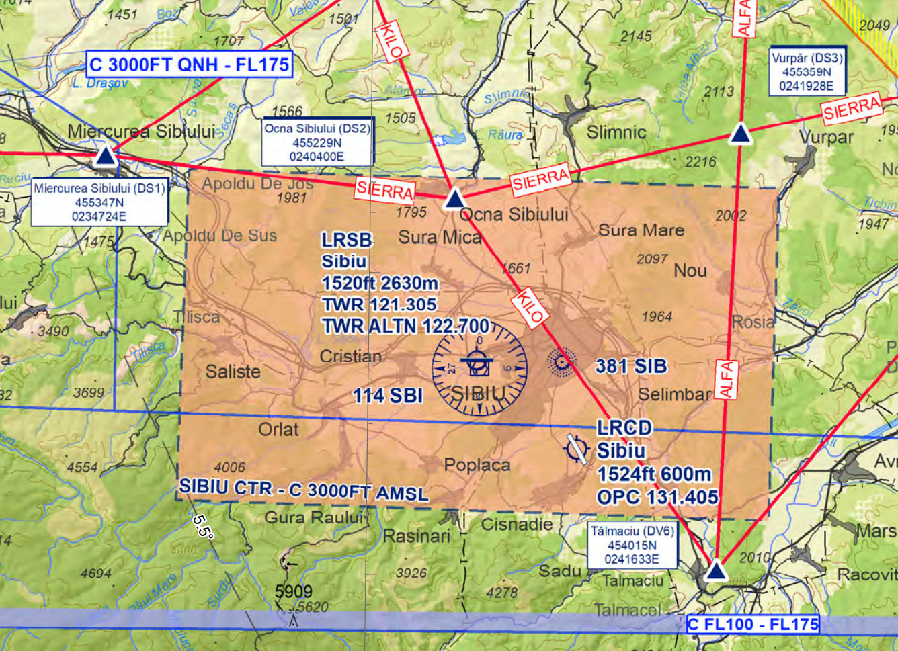

LRSB - Sibiu International
==========================
General
"""""""

Sibiu Airport is the second airport in Transylvania region. It is located in the North of the Transylvanian Alps and the main airport of Sibiu, an essential cultural and economic center from the South of Transilvania.

Frequencies
"""""""""""

+-----------------+-----------------+-----------+
| Login Call sign | Call sign       | Frequency |
+-----------------+-----------------+-----------+
| LRSB _TWR       | Sibiu Tower     | 122.700   |
+-----------------+-----------------+-----------+
| LRCL_APP        | NAPOC Approach  | 126.425   |
+-----------------+-----------------+-----------+
| LRBB_N_CTR      | Bucharest Radar | 127.075   |
+-----------------+-----------------+-----------+
| LRBB_L_CTR      | Bucharest Radar | 122.025   |
+-----------------+-----------------+-----------+

Area of Responsability
""""""""""""""""""""""

TWR is responsible for air traffic service on runway 09/27 and Sibiu Control Zone, taxiways and aprons. TWR issues clearances, both IFR and VFR.

APP is responsible for air traffic service in TMA NAPOC, classified as Class C Airspace, where both IFR and VFR are allowed to fly.

Area charts
"""""""""""

ATIS
""""

TWR is responsible for updating and maintaining Cluj ATIS.

Runway operations
"""""""""""""""""

The airport has one runway: 09/27.

Due to noise abatement procedures, preferred runway for departure is 27 and for arrival is 09, applied only in low traffic conditions. Any change of the departure and/or arrival direction shall be coordinated with APP unit.

All aircarfts with APC more than B has to do backtrack runway 27 from intersection with taxiway E before departure. In normal circumstances, this procedures takes 2 minutes until the aircraft is fully ready for departure.

+-----------------+--------------+--------------+
| Runways         | 09           | 27           |
+-----------------+--------------+--------------+
| Runway heading  | 86           | 266          |
+-----------------+--------------+--------------+
| Length          | 8629ft/2630m                |
+-----------------+--------------+--------------+
| ILSAPP          | NO           | CAT1         |
+-----------------+--------------+--------------+
| VORAPP          | NO           | NO           |
+-----------------+--------------+--------------+
| NDBAPP          | YES          | NO           |
+-----------------+--------------+--------------+
| Prefered config | ARR          | DEP          |
+-----------------+--------------+--------------+
| Deicing         | on parking position         |
+-----------------+--------------+--------------+

Clearance
"""""""""

Both RNAV and conventional SIDs are available, but RNAV are highly recommended. Non standard departure shall be coordinated with APP unit.

Taxi
""""

Departing and arriving traffic shall be instructed to follow standard taxi routes available on AIP LR AD 2.13-8.

Stand assignments
"""""""""""""""""

It is generally at the discretion of the ATC.

+-------+--------+-------------------+
| Apron | Stands | Procedure         |
+-------+--------+-------------------+
| 1     | 1-4    | self maneuvering  |
+       +--------+-------------------+
|       | 5-6    | push-back only    |
+       +--------+-------------------+
|       | 7-11   | self maneuvering  |
+-------+--------+-------------------+

LVP
"""

During LVP, aircrafts shall be instructed to follow standard taxi routes with Follow Me guidance.

Traffic regulation
""""""""""""""""""

CTR Sibiu is classified as Class C Airspace where both IFR and VFR are allowed to enter.

CTR Sibiu lower limit is the ground level and the upper limit is 3000 ft AMSL (by QNH).

On the area chart there are all VFR points in CTR Sibiu. An extented map of whole TMA VFR Routes could be find on AIP LR ENR 6-70.

VFR traffic circuits are allowed on the north side of the airport, at max. 2500 ft AMSL (by QNH). VFR traffic could be cleared to climb in TMA only by the APP unit. Coordination between TWR and APP units shall be in force.
