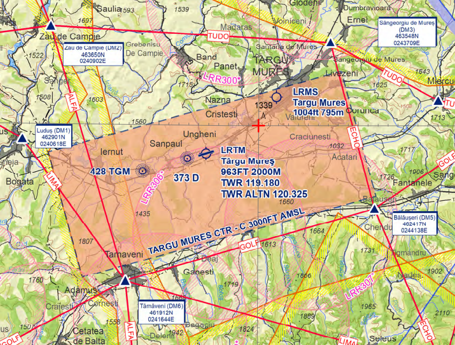

LRTM - Târgu Mureș International
================================

General
"""""""

Targu Mures Transilvania Airport is the third aiport in Transylvania area. 

Frequencies
"""""""""""

+-----------------+-------------------+-----------+
| Login Call sign | Call sign         | Frequency |
+-----------------+-------------------+-----------+
| LRTM_TWR        | Targu Mures Tower | 120.325   |
+-----------------+-------------------+-----------+
| LRCL_APP        | NAPOC Approach    | 126.425   |
+-----------------+-------------------+-----------+
| LRBB_N_CTR      | Bucharest Radar   | 127.075   |
+-----------------+-------------------+-----------+
| LRBB_L_CTR      | Bucharest Radar   | 122.025   |
+-----------------+-------------------+-----------+

Area of Responsability
""""""""""""""""""""""

TWR is responsible for air traffic service on runway 07/25 and Targu Mures Control Zone, taxiways and aprons. TWR issues clearances, both IFR and VFR.

APP is responsible for air traffic service in TMA NAPOC, classified as Class C Airspace, where both IFR and VFR are allowed to fly.

Area charts
"""""""""""

ATIS
""""

TWR is responsible for updating and maintaining Targu Mures ATIS.

Runway operations
"""""""""""""""""

The airport has one runway: 07/25.

Due to apron location, preferred runway for departure is 25 and for arrival is 07, applied only in low traffic conditions. Any change of the departure and/or arrival direction shall be coordinated with APP unit.

All aircarfts shall depart from the runway threshold.

+-----------------+--------------+--------------+
| Runways         | 07           | 25           |
+-----------------+--------------+--------------+
| Runway heading  | 69           | 249          |
+-----------------+--------------+--------------+
| Length          | 6562ft/2000m                |
+-----------------+--------------+--------------+
| ILSAPP          | NO           | CAT2         |
+-----------------+--------------+--------------+
| VORAPP          | NO           | NO           |
+-----------------+--------------+--------------+
| NDBAPP          | YES          | YES          |
+-----------------+--------------+--------------+
| Prefered config | ARR          | DEP          |
+-----------------+--------------+--------------+
| Deicing         | on parking position         |
+-----------------+--------------+--------------+

Clearance
"""""""""

Both RNAV and conventional SIDs are available, but RNAV are highly recommended. Non standard departure shall be coordinated with APP unit.

Taxi
""""

Departing and arrived traffic shall be instructed to follow standard taxi routes available on AIP LR AD 2.15-8.

Stand assignments
"""""""""""""""""

It is generally at the discretion of the ATC.

+-------+--------+-------------------+
| Apron | Stands | Procedure         |
+-------+--------+-------------------+
| 1     | 1-3    | self maneuvering  |
+-------+--------+-------------------+
| 2     | 4-7    | self maneuvering  |
+-------+--------+-------------------+

Traffic regulation
""""""""""""""""""

CTR Targu Mures is classified as Class C Airspace where both IFR and VFR are allowed to enter.

CTR Targu Mures lower limit is the ground level and the upper limit is 3000 ft AMSL (by QNH).

On the area chart there are all VFR points in CTR Targu Mures. An extented map of whole TMA VFR Routes could be find on AIP LR ENR 6-70.

VFR traffic circuits are allowed in the north side of the airport, at 2000 ft AMSL (by QNH). VFR traffic could be cleared to climb in TMA only by APP unit. A coordination between TWR and APP units shall be in force.
